# 网络模型和网购

网购

TCP/IP模型

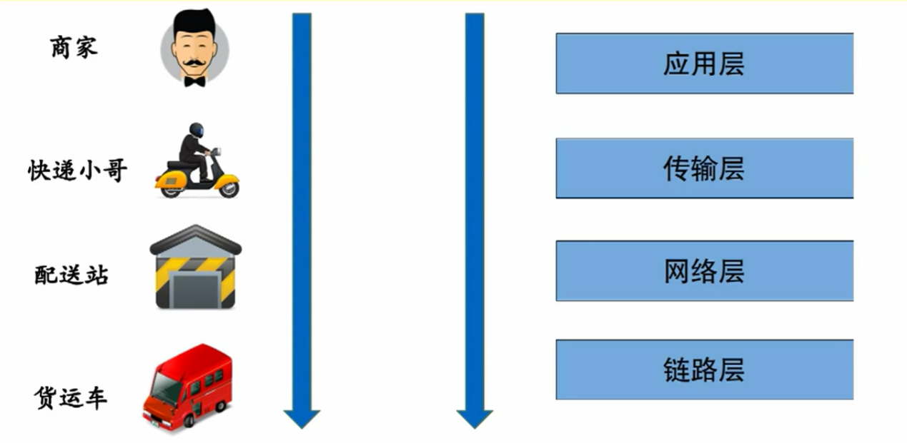

从下往上看

## 链路层

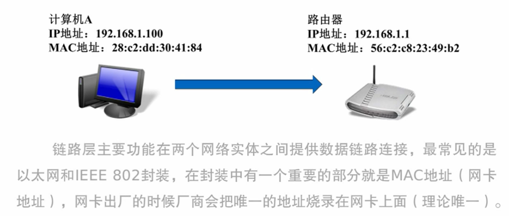

## 网络层

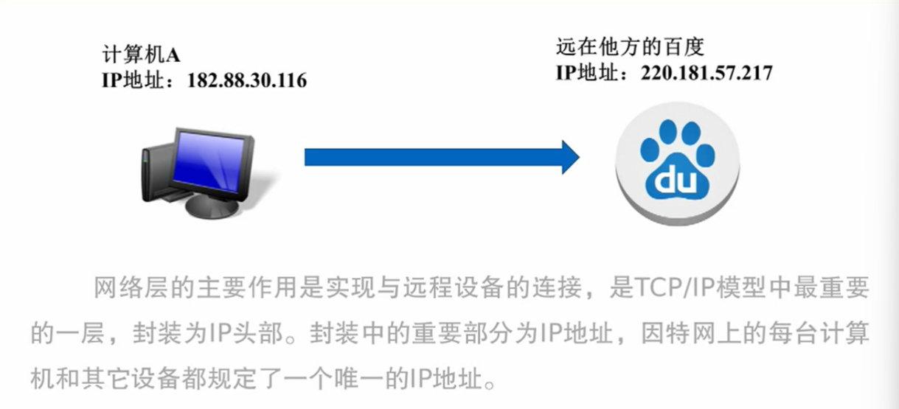

为什么需要两种地址？

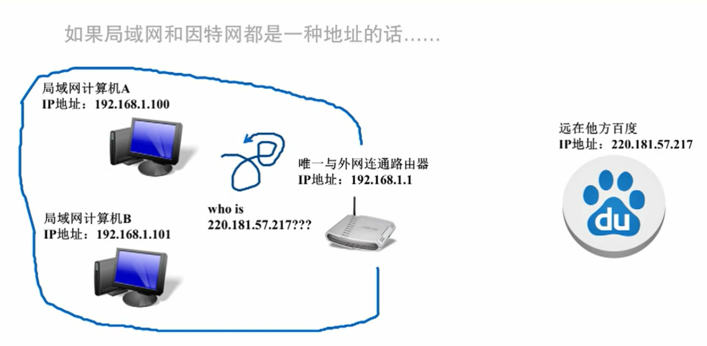

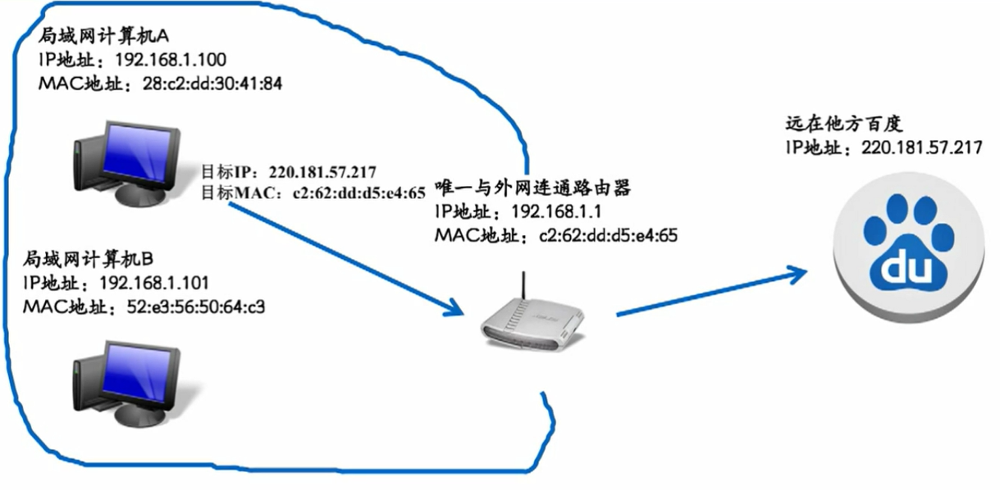

数据包像接力赛跑一样一层一层传过去

是否有办法查看这些间隔的路由呢？

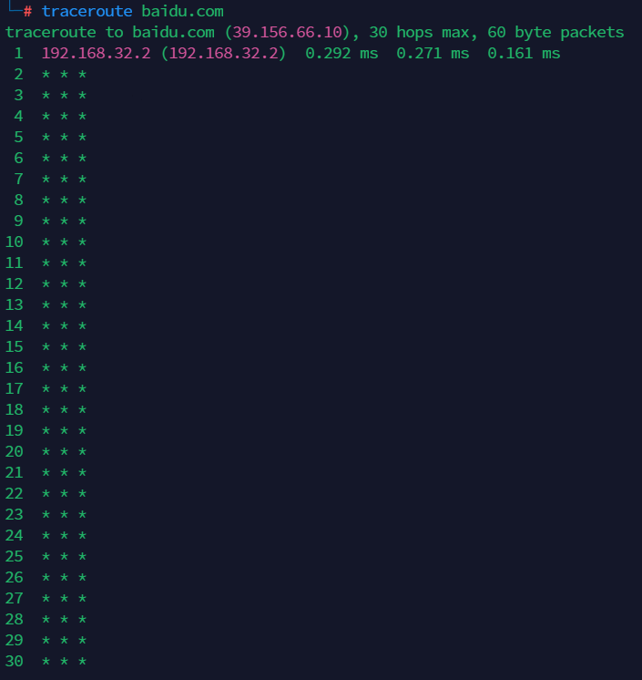

这么多*** 是怎么回事？

有些路由禁用了ICMP返回包的功能，所以看不到

## 传输层

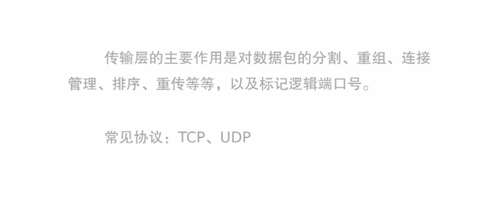

端口是如何工作的？

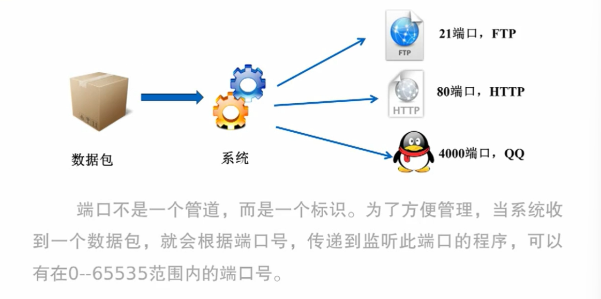

TCP与UDP协议

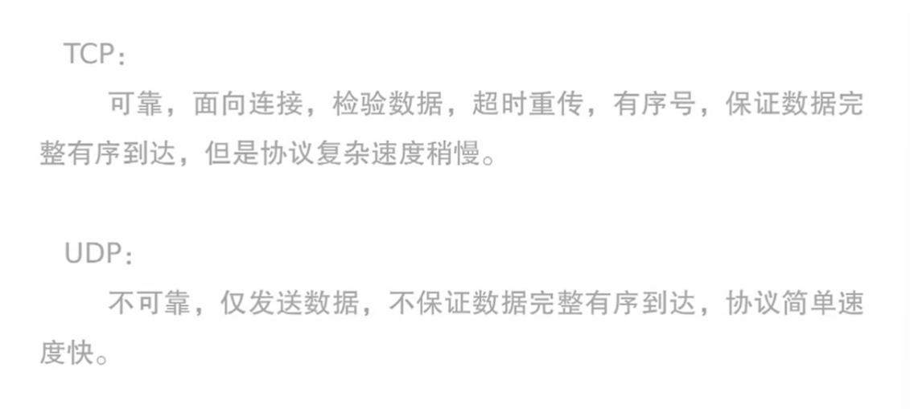

UDP传输机制

数据包中的路痴

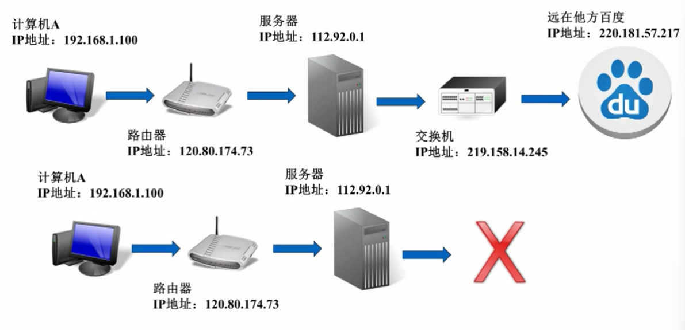

导致

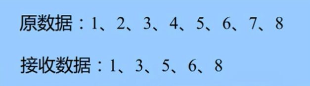

实际网络下，数据包路过的路径长短不同

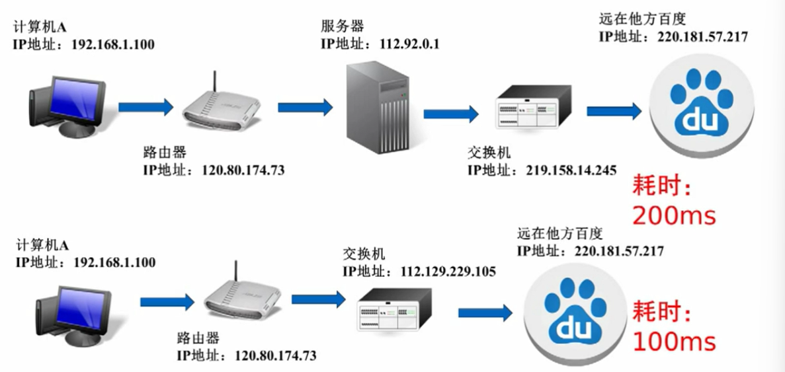

导致

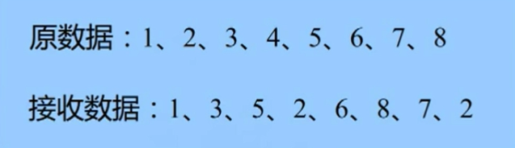

## 应用层

网络层的实现

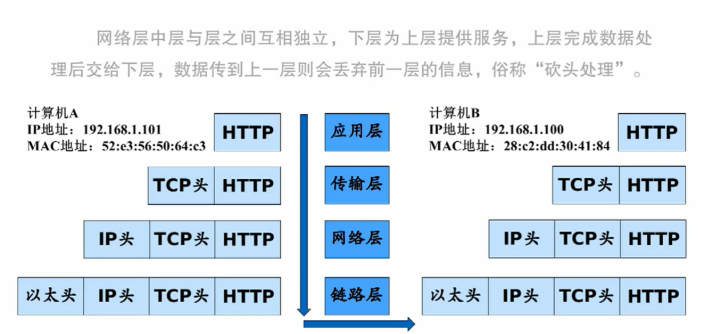

# 数据包的一生

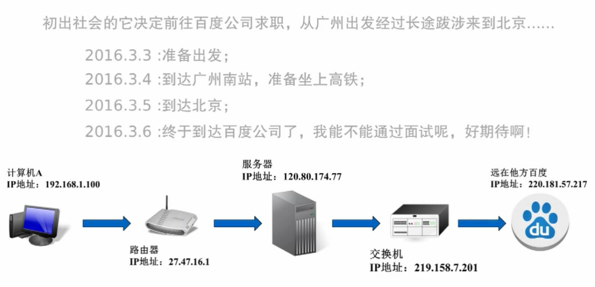

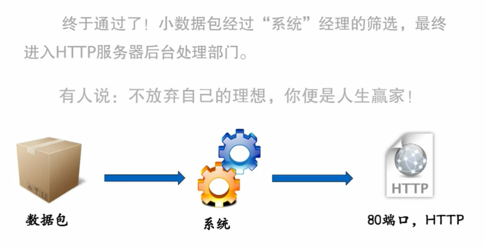

